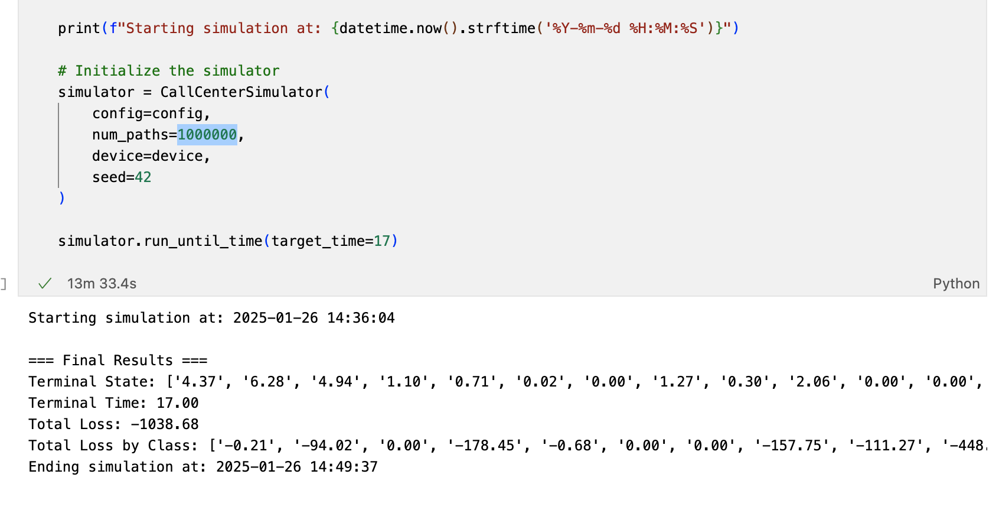

# TorchSimulator

TorchSimulator is a demonstration framework designed to showcase how parallel, **tensorized simulations on GPUs** can accelerate performance. It provides a foundation for building custom simulation classes by allowing users to inherit from the provided `CTMCSimulator` or `CTMDPSimulator` classes.


## Tutorial

See an example of how to create a simulation class by inheriting from the `CTMDPSimulator` class in the [tutorial.ipynb](tutorial.ipynb) notebook. The tutorial demonstrates this process using a dynamic scheduling problem in a queueing system.

## Performance

The tutorial above walks through a dynamic scheduling problem for a queueing system, where each sample path spans 17 days (approximately 20,000 events). 

While simulating 10,000 sample paths takes about 10 minutes on CPU (using C++), GPU acceleration enables running 1,000,000 paths within 15 minutes. This is a $\approx$ **60x** speedup.



## Installation

1. **Clone the Repository:**

   ```bash
   git clone https://github.com/steve-shao/TorchSimulator.git
   cd TorchSimulator
   ```

2. **Set Up a Conda Environment:**

   ```bash
   conda env create -f environment.yml
   conda activate torchsim
   ```

You can check and play with the code by running

```bash
python -m simulator.ctmc_base
python -m simulator.ctmdp_base
python -m simulator.ctmc_examples.mm1_queue
```

## License

This project is licensed under the [MIT License](LICENSE).
